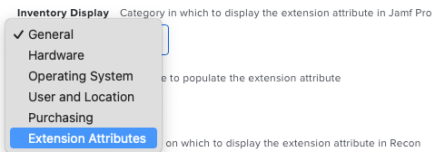

# BreakGlassAdmin


A workflow to create/manage a backdoor admin account *(e.g. 'breakglass')* with a password that is unique to each computer, rotate the password regularly, and make the password available in Jamf for use. _(E.g. Another LAPS workflow.)_

<!-- TOC depthFrom:1 depthTo:6 withLinks:0 updateOnSave:1 orderedList:0 -->

- [BreakGlassAdmin](#breakglassadmin)
	- [Background](#background)
	- [Usage](#usage)
		- [4 - Admin Username and Full Name](#4-admin-username-and-full-name)
		- [5 - Available Password Methods](#5-available-password-methods)
		- [6 - Extension Attribute](#6-extension-attribute)
		- [7 - Storage Method](#7-storage-method)
			- [Storing the password in Jamf Pro *(default)*](#storing-the-password-in-jamf-pro-default)
			- [Storing the password on the local client](#storing-the-password-on-the-local-client)
		- [11 - Overrides](#11-overrides)
	- [Supplemental Scripts](#supplemental-scripts)
	- [Future Upgrades](#future-upgrades)
	- [Warnings and Disclaimers](#warnings-and-disclaimers)

<!-- /TOC -->

## Background

Where there are several other implementations of LAPS for Macs out in the Jamf Nation and Mac Admins communities, this version was created to serve as a single solution for all our clients that can be configured through policy parameters.

## Usage

Towards the top of the script are the following parameters:
4. The username and (optionally) full name of the admin account
5. Which method of creating a password to use (see below)
6. Name of extension attribute where password is store (e.g. "Breakglass Admin")
7. Storage method: Provide BASE64 encoded "user:password" for storage via API. Otherwise locally stored.
11. Overrides (optional)

#### Admin Username and Full Name
The short username of the admin user to create/update.

Optionally, a full name can be provided. Otherwise, the short name will be used for both.

Example:
> breakglass Breakglass Admin

#### Available Password Methods
The following options/schemes for generating passwords are available:
+ nato - Combines three (by default) NATO phonetic letters _(e.g. WhiskeyTangoFoxtrot)_
+ wopr - Like the launch codes in the 80s movie, ["Wargames"](https://www.imdb.com/title/tt0086567) _(e.g. "CPE 1704 TKS")_
+ xkcd - Uses the system from the XKCD webcomic (https://xkcd.com/936/) by pulling four (by default) words between 4-8 characters long from /usr/share/dict/words _(e.g. CorrectHorseBatteryStaple)_
+ names - Uses the same scheme as above but only with the propernames database (e.g. AliceBobEveMallory)
+ pseudoRandom - Based on University of Nebraska' LAPS system (https://github.com/NU-ITS/LAPSforMac)
+ custom - Customizable format with the following defaults:
	* 16 characters
	* 1 Upper case character (min)
	* 1 Lower case character (min)
	* 1 Digit (min)
	* 1 Special character (min)
	+ _Optionally you can add a string to specify overrides in the following format: N=20;U=3;L=1;D=2;S=0_

#### 6 - Extension Attribute

The name of the Extension Attribute in which to store the password.

#### 7 - Storage Method

##### Storing the password in Jamf Pro *(default)*



Provide the base64 encoded username and password of a Jamf Pro (API) user account with *READ* **and** *UPDATE* permissions for the *Computers* object as well as for the following objects based on the *Inventory Display* option for the Extension Attribute:
* User and Location - *Users*
* Extension Attributes - *Computer Extension Attributes*

To get the encoded string, enter the following command into Terminal:
> echo -n "USERNAME:PASSWORD" | base64 | pbcopy

Where *USERNAME* and *PASSWORD* should be replaced the appropriate info.

**Note:** This will *NOT* display any result. Instead it will be in your clipboard for pasting elsewhere. Because *'echo -n'* prevents a final line-feed, it can be confusing which parts you need to copy.

##### Storing the password on the local client

If this parameter is blank, the password will be stored locally in a plist file in */Library/Preferences/* with root-only access.

**Note:** The password stored in this file will be in cleartext. Some may argue that this is insecure. But to get it, the user would need admin privileges and use something like *sudo -s* to elevate to root in order to get it. If they can do that, they don't *need* your backdoor admin access and you have an HR/Policy issue bigger than your technology issue.

#### 11 - Overrides

After the main variables/parameters block, there is a section that includes the following:
```bash
DEBUG='' ## Default is off. Any value makes it true.
NUM=''  ## Override for each password method's defaults
        ##           nato =  3 words
        ##           xkcd =  4 words
        ##           name =  4 names
        ##   pseudoRandom = 16 characters
HIDDENFLAG="-hiddenUser" ## Set to empty for visible
FORCE="0" ## 1 (true) or 0 (false) - USE WITH EXTREME CAUTION!
          ## If true and old password is unknown or can't be changed,
          ## the script will delete the account and re-create it instead.
STOREREMOTE="" ## Set to 'Yes' below -IF- APIHASH is provided
STORELOCAL=""  ## Set to 'Yes' below -IF- no APIHASH or overriden
LOCALPATH="/Library/Preferences"
LOCALPREFIX="tech.rocketman"

## Allow for overrides of everything so far...
## If the 11th policy parameter contains an equal sign, run eval on the
## whole thing.
## Example: If $11 is 'NUM=5;HIDDENFLAG=;FORCE=1;STORELOCAL="Yes"', then
##  the values of the variables with the same name of those above would change.
## WARNING! This would be HORRIBLE security in a script that remains local
##          as any bash-savvy user could inject whatever code they wanted to.
##          This danger is LESSENED by the fact that the parameters are
##          provided at run-time by Jamf and the script is not stored on
##          the computer outside the policy run.
[[ "$11" == *"="* ]] && eval ${11} ## Comment out to disable
```

Rather than turn each of these options into their own policy parameter, these options are defined in a block here. They can either be directly edited _(hardcoded)_ in the script or overridden by passing in a variable assignment string into parameter 11.

For example; if _'nato'_ was the selected password method and the following was entered into parameter 11 of the policy:
> NUM=5;HIDDENFLAG=;FORCE=1;STORELOCAL="Yes"

The resulting changes would take place:
* The password would consist of _five_ NATO words instead of three
* The admin account would be created as visible in System Preferences and with a UID > 500
* If the existing password can't be found or if the password change fails, the FORCE option will attempt to delete the account and re-create it
* The password will be stored in the local file _even if_ the remote option is used

**Note:** As mentioned in the comment block, running 'eval' on an unsanitized string would be a _terrible_ idea with a normal script. For a Jamf script, some may still consider it problematic. In which case, simply comment out or delete the line.

## Supplemental Scripts

There are two additional support scripts in this repository:

* **Extension Attribute.sh** - If you are choosing to store the password on the client side, but want it copied into Jamf, create a script-based extenstion attribute with this code to have each computer send that password during recon.
* **Set Default Password.sh]** - This workflow was originally designed to create and then manage the password for an account. For organizations wishing to use an existing admin account with a fixed password, this script will set the local or remote extension attribute to the existing value before the main script runs.

## Future Upgrades

- [X] ~~Add option to store password locally *and* via API call at the same time~~
- [ ] Add capability to encrypt and decrypt the password during local storage
- [X] ~~Add another password mode to simulate the launch codes in one of my favorite movies, the 1983 classic, [WarGames](https://www.imdb.com/title/tt0086567/). (e.g. CPE1704TKS)~~

## Warnings and Disclaimers

This script is provided as-is. While we do our best to make sure it will work as described and without harmful side-effects, there are no guarantees. Use at your own risk.
